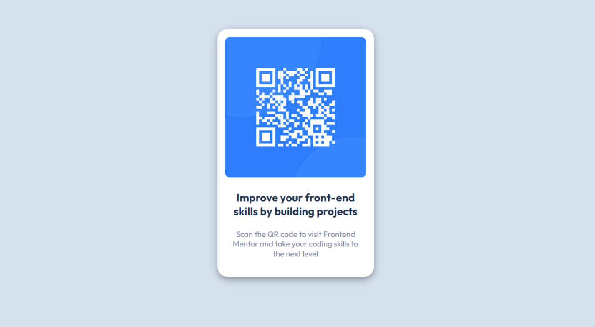

# Frontend Mentor - QR code component solution

This is a solution to the [QR code component challenge on Frontend Mentor](https://www.frontendmentor.io/challenges/qr-code-component-iux_sIO_H). Frontend Mentor challenges help you improve your coding skills by building realistic projects.

## Table of contents

- [Overview](#overview)
  - [Screenshot](#screenshot)
  - [Links](#links)
- [My process](#my-process)
  - [Built with](#built-with)
  - [What I learned](#what-i-learned)
  - [Continued development](#continued-development)
- [Author](#author)
- [Acknowledgments](#acknowledgments)

**Note: Delete this note and update the table of contents based on what sections you keep.**

## Overview

This is a solution to the [QR code component challenge on Frontend Mentor](https://www.frontendmentor.io/challenges/qr-code-component-iux_sIO_H). This project is completed on 12/9/2022. The component is static but works fine for desktop version and mobile version.

### Screenshot

### Links

- Solution URL: [Add solution URL here](https://github.com/nabbysidek/qr-code-component-main)
- Live Site URL: [Add live site URL here](https://nabbysidek.github.io/qr-code-component-main/)

## My process

### Built with

- Semantic HTML5 markup
- CSS custom properties

### What I learned

I finally learn how to use Git and GitHub and will never go back to the old ways. I also tried to ensure that the HTML and CSS codes are clean.

## Continued development

I will continue to learn and apply ways to ensure that my codes are clean and consistent, and easy to read as well.

## Author

- Website - [Nur Aina Balqis Mohamad Rosidek](https://github.com/nabbysidek)
- Frontend Mentor - [@nabbysidek](https://www.frontendmentor.io/profile/nabbysidek)
- Instagram - [@codewsalem](https://www.instagram.com/codewsalem/)

## Acknowledgments

I'd like to thank CoderCoder on YouTube for the amazing introduction video to Git, GitHub and GitHub Desktop and providing a thorough rundown on the features and benefits of using Git and GitHub.
